# Microsoft 365 / Entra ID / Intune Administration Lab

## Overview

I built this lab to develop hands-on experience with Microsoft cloud identity, endpoint management, application deployment, security policy, and help-desk troubleshooting.

The environment uses a Microsoft 365 Business Premium tenant, Microsoft Entra ID, Microsoft Intune, and a Windows 11 Pro virtual machine. I configured the environment from the ground up and used it to practice common tasks performed by help desk, desktop support, endpoint support, and junior systems administrators.

The project includes:

- Microsoft 365 tenant administration
- Microsoft Entra ID identity management
- User and group provisioning
- Microsoft 365 licensing
- Windows 11 Entra join
- Microsoft Intune enrollment
- Device configuration policies
- Compliance policies
- Microsoft Store app deployment
- Win32 application packaging and deployment
- MFA and Conditional Access
- Windows Update management
- BitLocker management
- Windows LAPS
- Identity troubleshooting
- Remote endpoint administration

---

## Lab Environment

| Component | Configuration |
|---|---|
| Organization | Cobo Technologies |
| Licensing | Microsoft 365 Business Premium |
| Identity | Microsoft Entra ID |
| Endpoint Management | Microsoft Intune |
| Pilot Endpoint | WIN11-INTUNE01 |
| Operating System | Windows 11 Pro |
| Virtualization | Oracle VirtualBox |
| Pilot User | Alex Rivera |
| Pilot Device Group | DG-Windows-Pilot |
| Conditional Access Pilot Group | SG-CA-MFA-Pilot |

---

## Architecture

```text
Microsoft 365 Business Premium
            |
            v
     Microsoft Entra ID
     |              |
     |              +--> Cloud users / groups / MFA
     |
     +--> Conditional Access
            |
            v
       Microsoft Intune
     |       |        |
     |       |        +--> Application deployment
     |       +----------> Compliance / security
     +------------------> Windows configuration
            |
            v
      WIN11-INTUNE01
      Windows 11 Pro
```

---

# 1. Microsoft 365 Tenant Setup

I created a Microsoft 365 Business Premium tenant for the fictional company **Cobo Technologies**.

This tenant became the foundation for the Entra ID, Intune, licensing, Conditional Access, and endpoint-management portions of the lab.

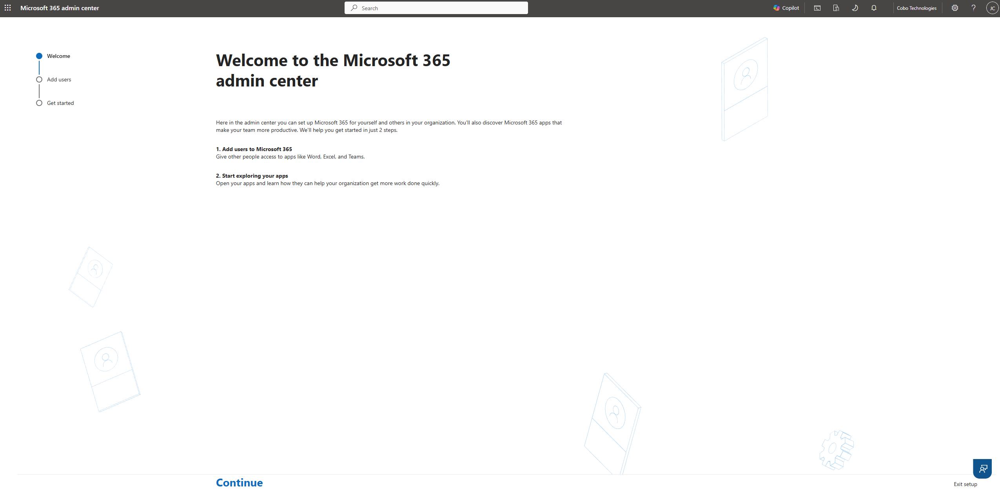

---

# 2. Microsoft Entra ID User Administration

I created the first standard cloud user directly through Microsoft Entra ID.

The initial IT user was:

```text
Alex Rivera
IT Support Technician
IT Department
```

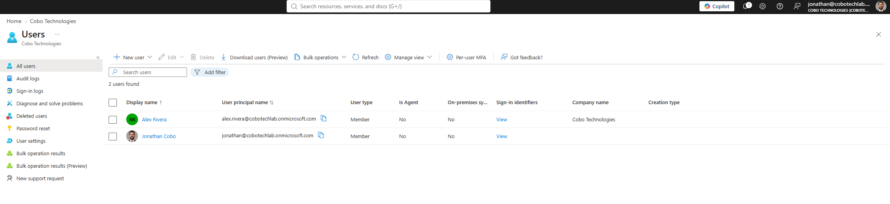

I then created the IT security group:

```text
SG-IT-Users
```

and added Alex as a member.

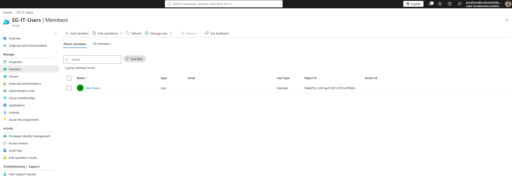

---

## Bulk User Provisioning

To practice a more scalable user-provisioning workflow, I used Microsoft's bulk user creation process with a CSV template.

Additional users were created across several departments.

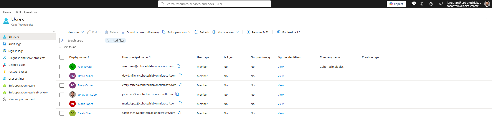

I organized users into departmental security groups:

```text
SG-IT-Users
SG-HR-Users
SG-Sales-Users
```

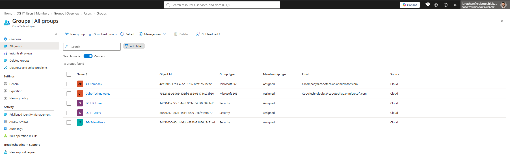

---

# 3. Microsoft 365 Licensing

Users exist independently from Microsoft 365 service licenses.

I assigned Microsoft 365 Business Premium to the pilot user while leaving other lab users unlicensed until needed.

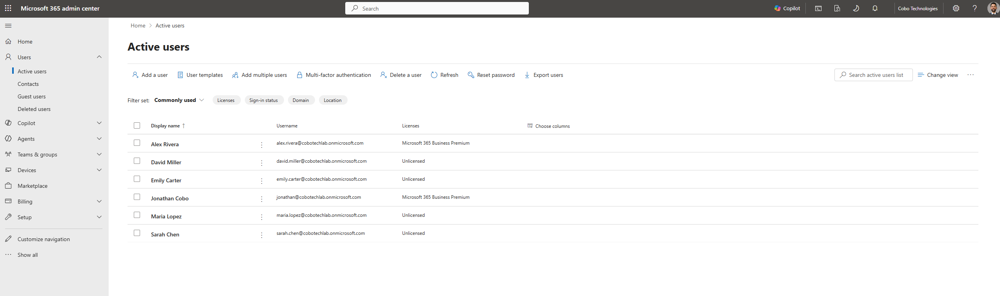

This reinforced the distinction between:

```text
Entra identity
        |
        +--> User exists

Microsoft 365 license
        |
        +--> User receives service entitlements
```

---

# 4. Intune Automatic Enrollment

I configured Intune automatic enrollment for members of the IT security group.

The MDM scope was configured for:

```text
SG-IT-Users
```

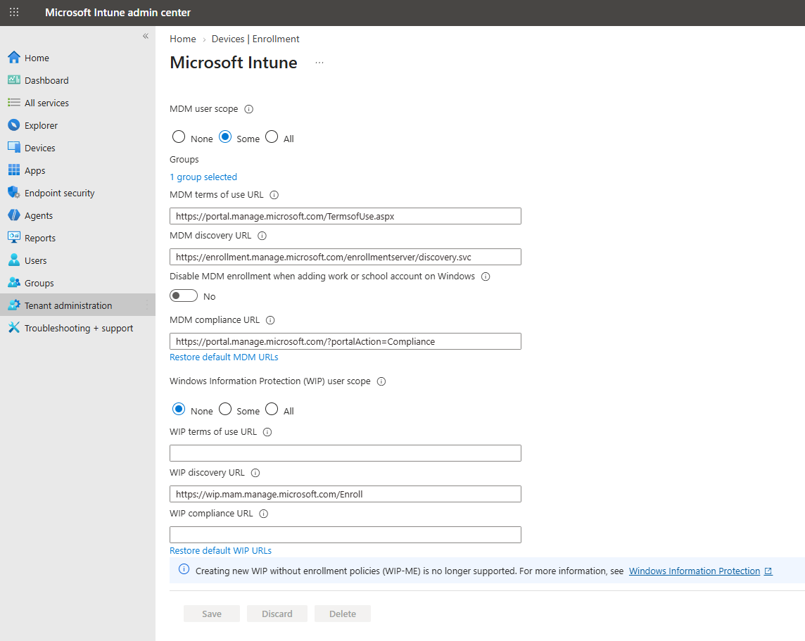

This allowed appropriately licensed users in the group to automatically enroll supported Windows devices into Intune.

---

# 5. Windows 11 Microsoft Entra Join

I created a dedicated Windows 11 Pro virtual machine:

```text
WIN11-INTUNE01
```

The VM was joined directly to Microsoft Entra ID.

I verified the join state with:

```powershell
dsregcmd /status
```

The device reported:

```text
AzureAdJoined : YES
EnterpriseJoined : NO
DomainJoined : NO
DeviceAuthStatus : SUCCESS
```

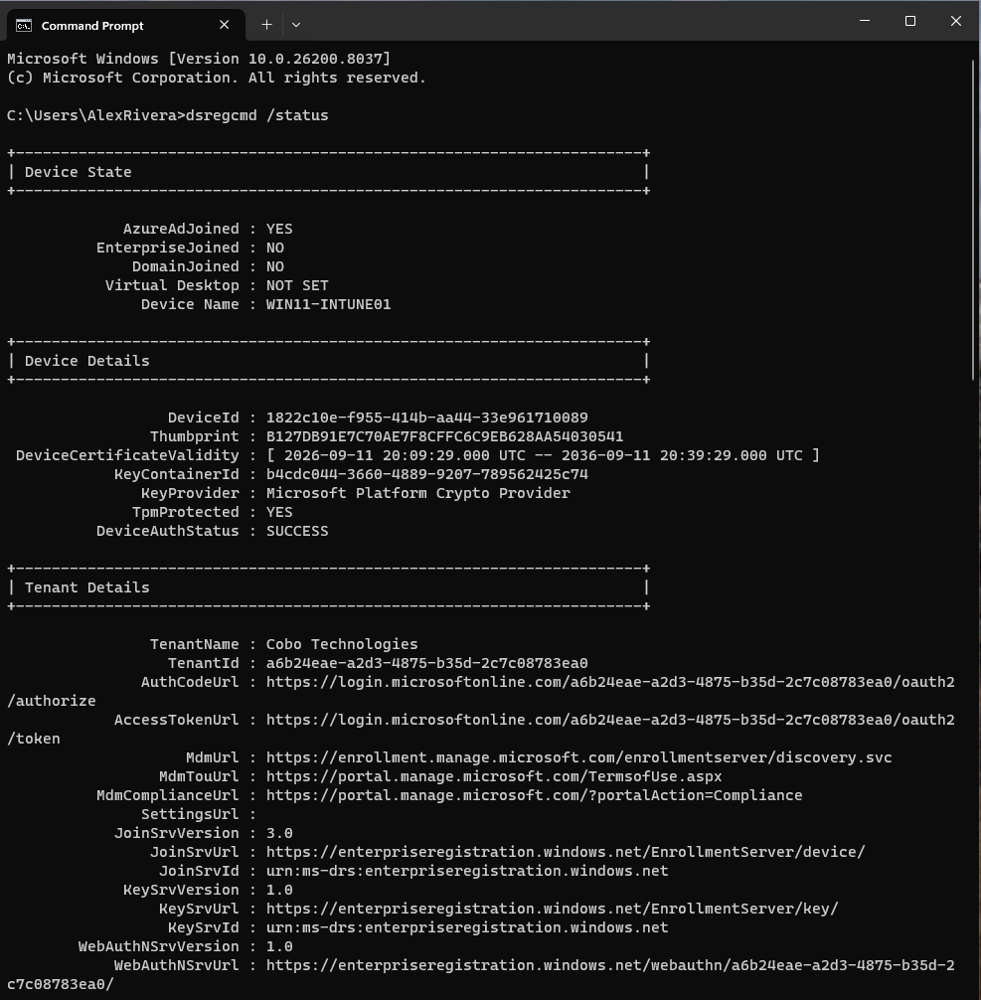

The device then appeared in Microsoft Intune as:

```text
Managed by: Intune
Ownership: Corporate
Compliance: Compliant
Primary user: Alex Rivera
```

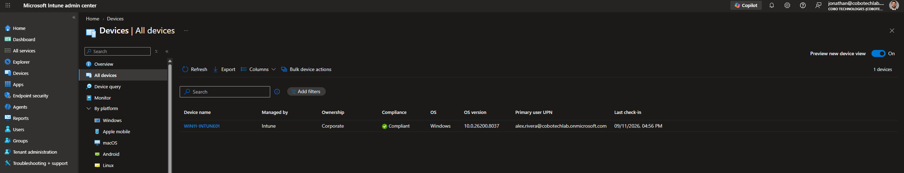

---

# 6. Intune Device Configuration

I created a Microsoft Edge Settings Catalog policy and assigned it to a dedicated pilot device group:

```text
DG-Windows-Pilot
```

The policy configured:

```text
Homepage: https://www.office.com
Show Home button: Enabled
New tab page as home page: Disabled
```

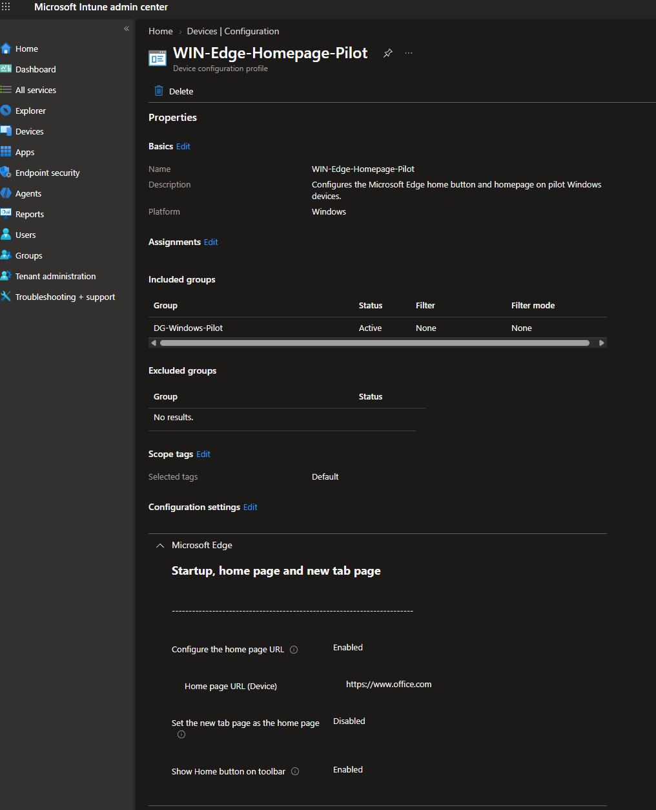

Before syncing the device, I verified that Edge had not yet received the policy.

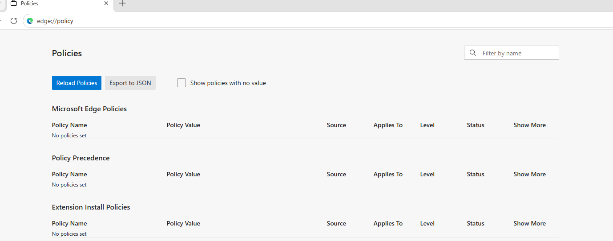

After forcing an Intune sync and reloading Edge policies, the configuration appeared on the endpoint.

The policy showed:

```text
Source: Platform
Applies To: Device
Level: Mandatory
Status: OK
```

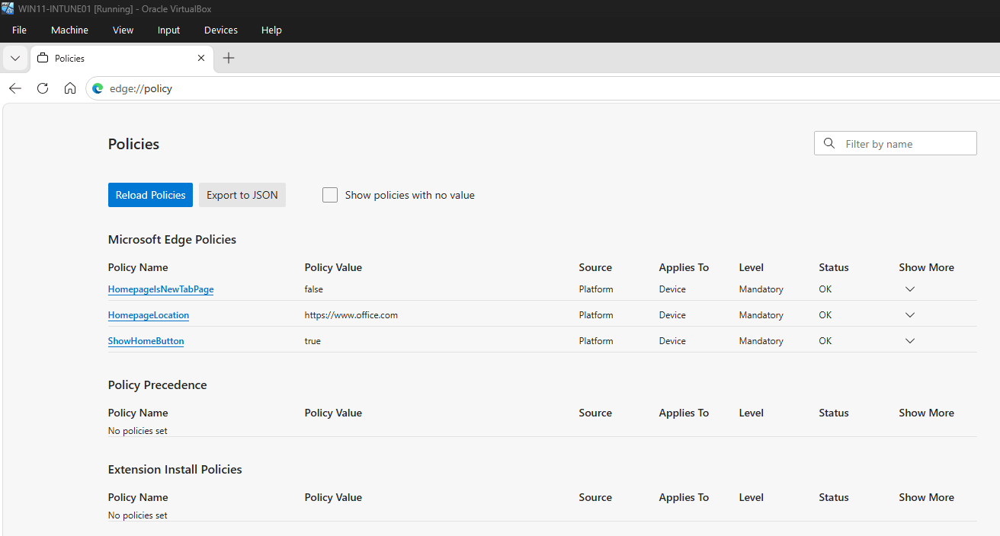

This demonstrated the complete workflow:

```text
Create policy
      |
      v
Assign pilot group
      |
      v
Sync endpoint
      |
      v
Verify locally
```

---

# 7. Intune Compliance Policy

I created a Windows compliance policy requiring Microsoft Defender Firewall.

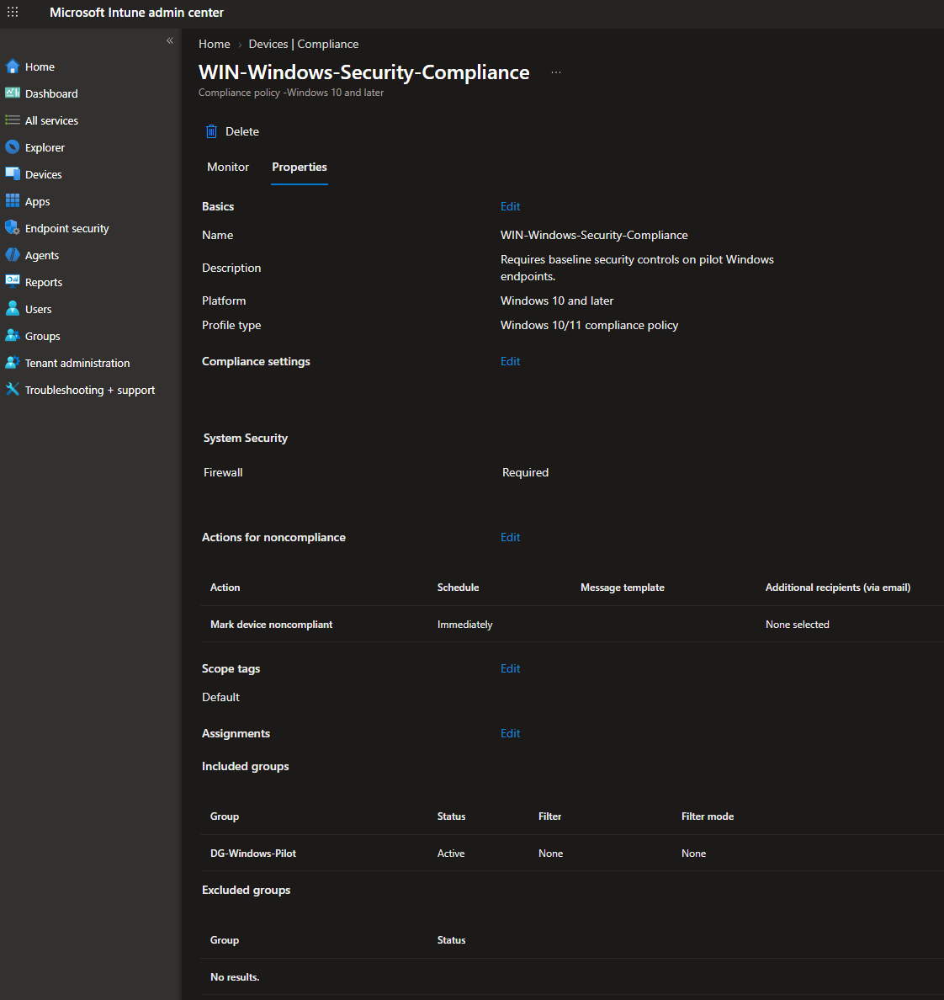

Initially, `WIN11-INTUNE01` was compliant.

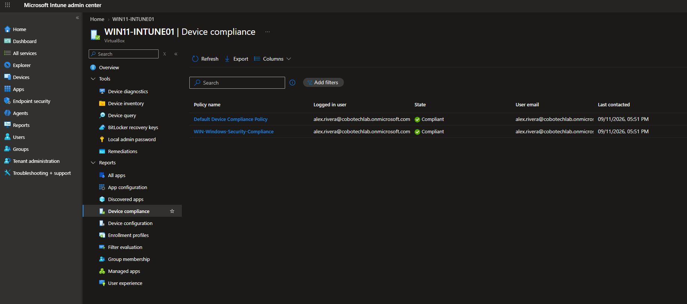

---

## Compliance Troubleshooting Scenario

To test the policy, I intentionally disabled the active Windows firewall profile.

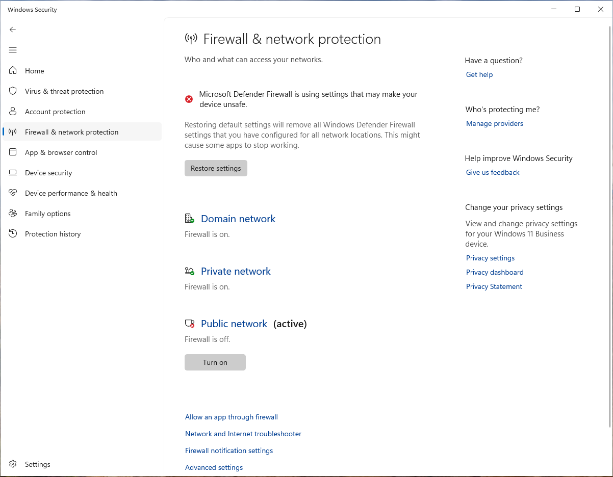

After syncing the endpoint, Intune detected the security-state change.

The device became:

```text
Not compliant
```

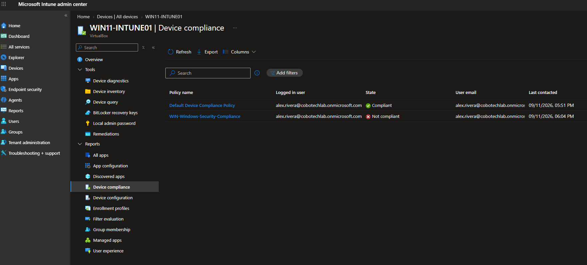

I opened the compliance-policy details to identify the failed setting.

Intune showed:

```text
Setting: Firewall
State: Not compliant
```

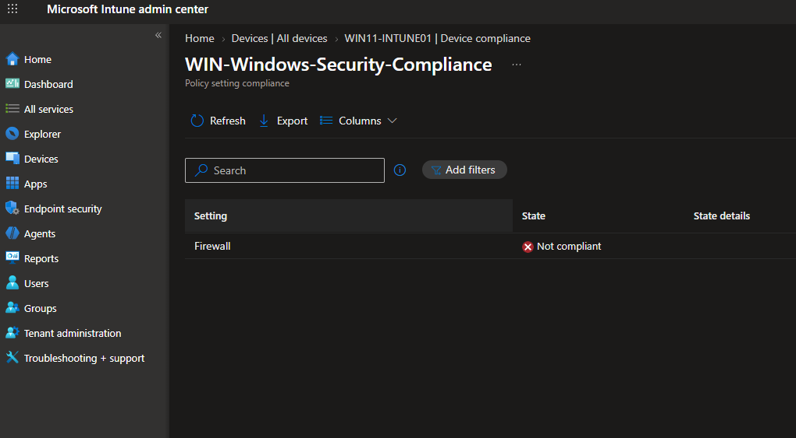

I restored Microsoft Defender Firewall and synced the endpoint again.

The device returned to:

```text
Compliant
```

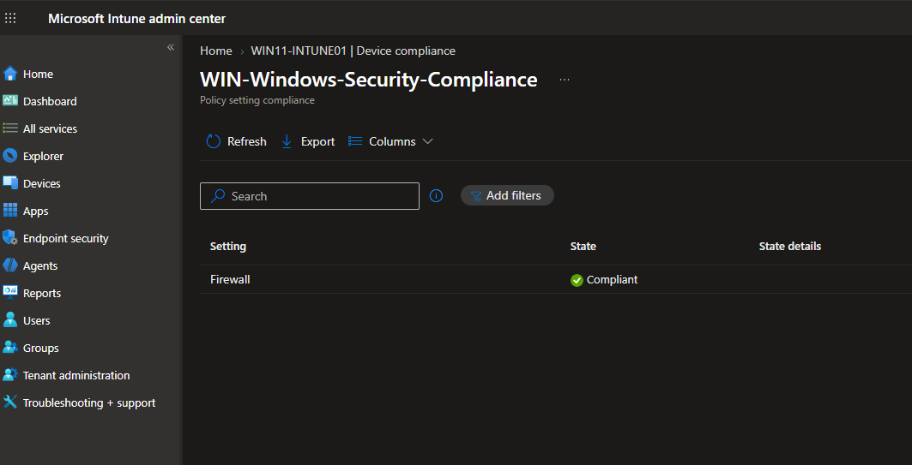

The complete troubleshooting workflow was:

```text
Healthy endpoint
      |
      v
Break firewall configuration
      |
      v
Intune detects noncompliance
      |
      v
Identify failed setting
      |
      v
Restore firewall
      |
      v
Verify compliance
```

---

# 8. Microsoft Store Application Deployment

I deployed **Company Portal** through Intune as a required Microsoft Store application.

The deployment was assigned to:

```text
DG-Windows-Pilot
```

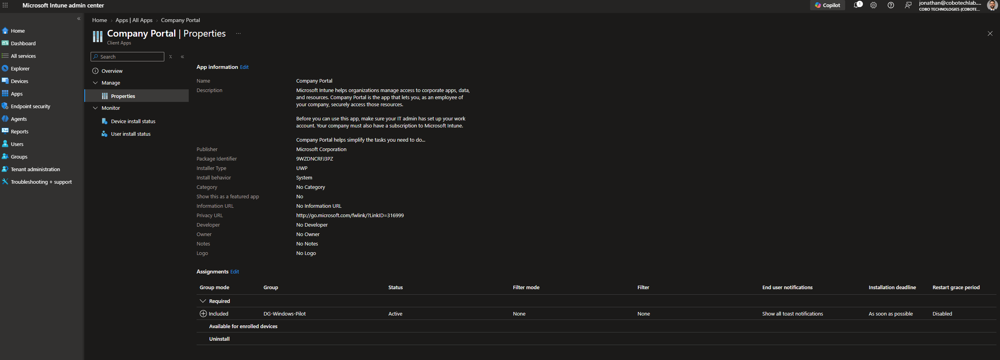

After the endpoint processed the assignment, Intune reported:

```text
Installation status: Installed
```

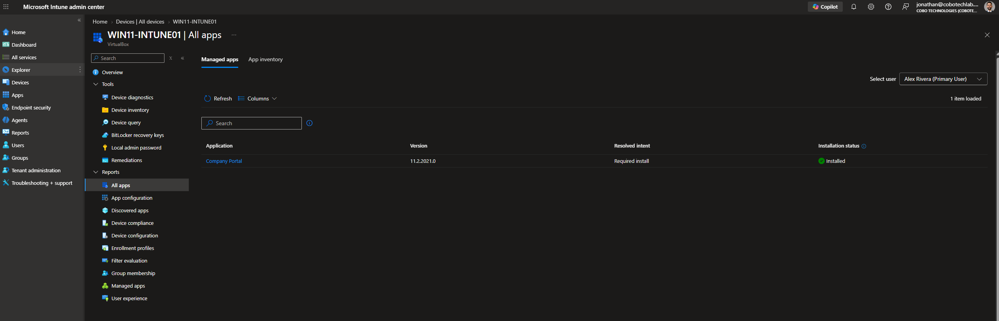

---

# 9. Win32 Application Packaging and Deployment

I packaged and deployed 7-Zip using Intune's Win32 application deployment workflow.

The original installer was:

```text
7z2603-x64.msi
```

I used the Microsoft Win32 Content Prep Tool:

```text
7z2603-x64.msi
        |
        v
IntuneWinAppUtil.exe
        |
        v
7z2603-x64.intunewin
```

The silent installation command was:

```cmd
msiexec /i "7z2603-x64.msi" /qn /norestart
```

The uninstall command was:

```cmd
msiexec /x "{23170F69-40C1-2702-2603-000001000000}" /qn /norestart
```

The deployment also included:

- x64 architecture requirement
- Windows version requirement
- System installation context
- MSI detection rule
- Required assignment to the pilot device group

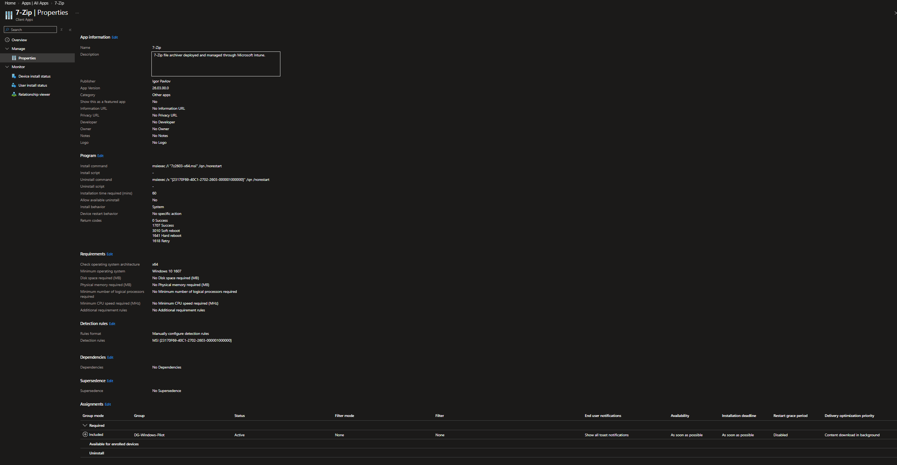

The device later reported:

```text
7-Zip
Installation status: Installed
```

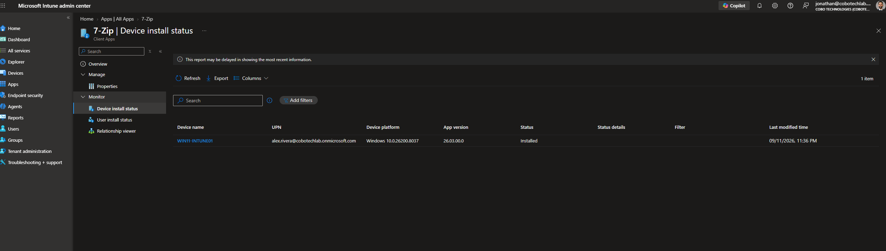

This demonstrated the complete Win32 deployment process:

```text
MSI installer
      |
      v
.intunewin package
      |
      v
Requirements
      |
      v
Install command
      |
      v
Detection rule
      |
      v
Device assignment
      |
      v
Installed
```

---

# 10. Conditional Access and MFA

I moved from Security Defaults to Microsoft's Conditional Access model.

The tenant contained Microsoft-managed baseline Conditional Access policies along with the custom pilot policy I created.

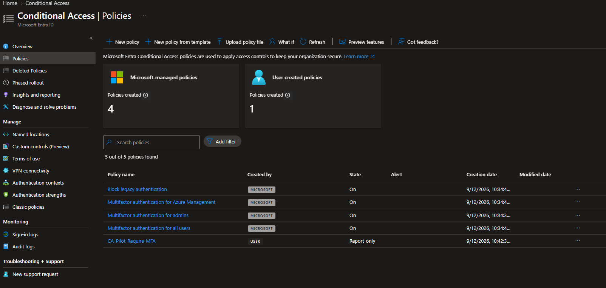

I created:

```text
CA-Pilot-Require-MFA
```

The policy targeted:

```text
SG-CA-MFA-Pilot
```

and all cloud resources.

The initial state was:

```text
Report-only
```

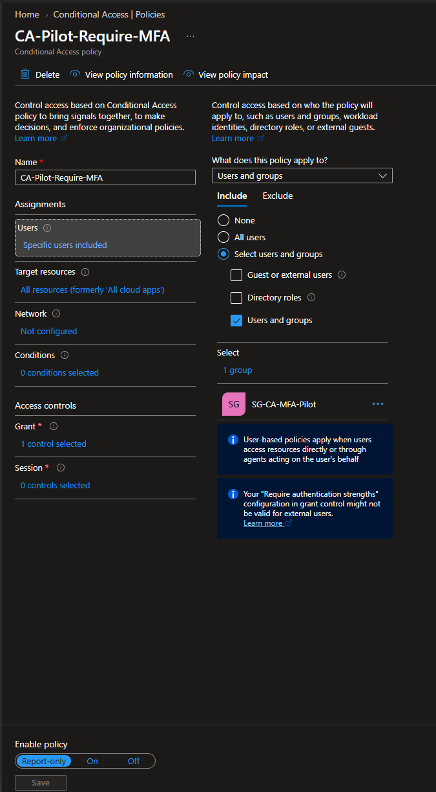

The grant control required Microsoft's built-in MFA authentication strength.

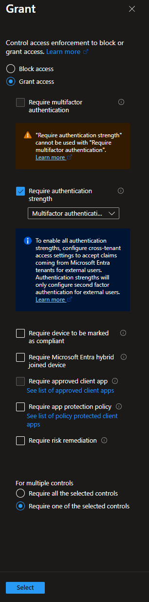

---

## Conditional Access What If Testing

Before enforcing the custom policy, I used the Conditional Access **What If** tool.

The simulated sign-in used:

```text
User: Alex Rivera
Platform: Windows
Client: Browser
Resource: Microsoft Graph
```

The test confirmed that the custom policy would apply.

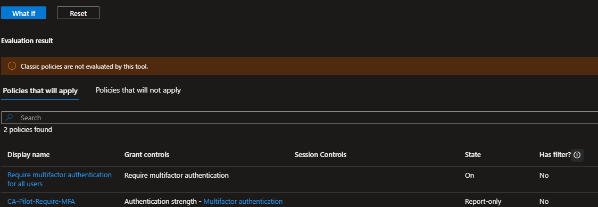

---

## Real MFA Authentication Validation

I then analyzed a real OfficeHome sign-in.

The authentication details showed successful authentication and an existing MFA requirement being satisfied.


The custom policy was evaluated against the real sign-in and returned:

```text
Report-only: Success
```

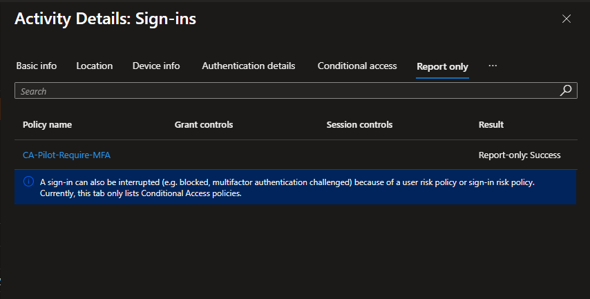

This demonstrated how Conditional Access can be tested against real authentication activity without enforcing the policy.

---

# 11. Conditional Access with Intune Device Compliance

I created a second custom policy:

```text
CA-Pilot-Require-Compliant-Windows-Device
```

The policy targeted the Conditional Access pilot group and all resources.

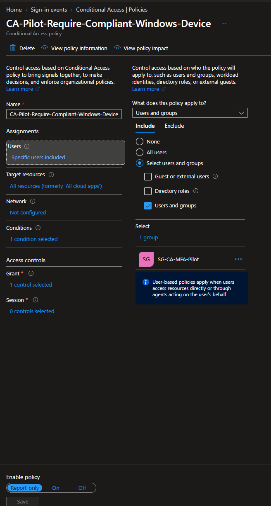

The condition was limited to:

```text
Windows
```

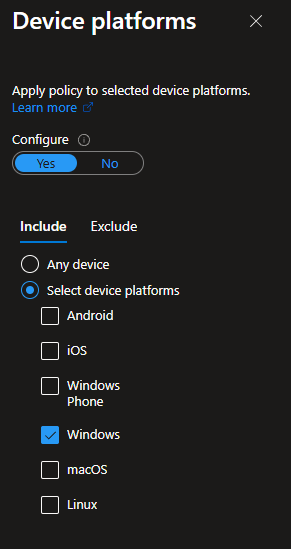

The grant requirement was:

```text
Require device to be marked as compliant
```

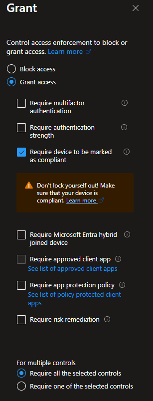

---

## Healthy Device Test

While `WIN11-INTUNE01` was compliant, the policy evaluated successfully.

```text
CA-Pilot-Require-Compliant-Windows-Device
Report-only: Success
```

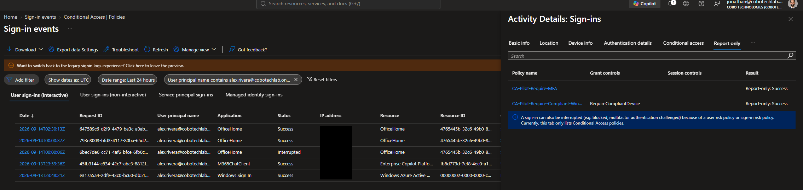

---

## Noncompliant Device Test

I intentionally disabled the active firewall profile again.

Intune detected the failed compliance state.

A new OfficeHome sign-in produced:

```text
CA-Pilot-Require-Compliant-Windows-Device
Report-only: Failure
```

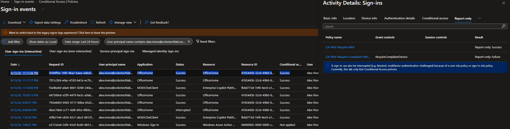

The same Entra sign-in record showed that the actual managed endpoint was recognized:

```text
Managed: Yes
Compliant: No
Join Type: Azure AD joined
```

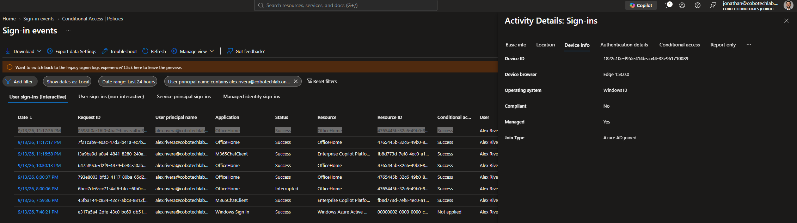

This proved that the failure was caused by the device's compliance state rather than missing device identity.

---

## Compliance Restored

I turned Microsoft Defender Firewall back on and synced the device.

Intune returned the endpoint to:

```text
Compliant
```

The next Conditional Access evaluation changed back to:

```text
Report-only: Success
```

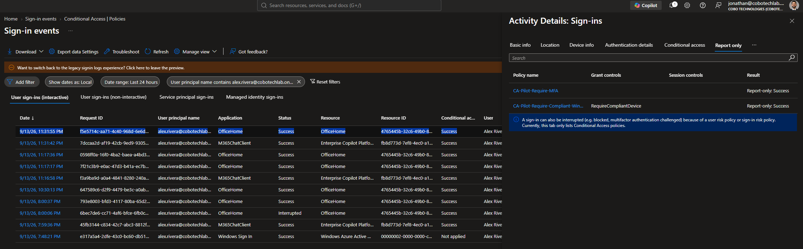

The complete workflow demonstrated:

```text
Endpoint security state
        |
        v
Intune compliance
        |
        v
Microsoft Entra Conditional Access
        |
        v
Cloud access decision
```

---

# 12. Windows Update Management

I created an Intune Windows Update Ring:

```text
WIN-Update-Ring-Pilot
```

The policy included:

```text
Microsoft product updates: Allow
Windows drivers: Allow

Quality update deferral:
0 days

Feature update deferral:
0 days

Active hours:
8:00 AM - 5:00 PM

Quality update deadline:
2 days

Feature update deadline:
7 days

Grace period:
1 day
```

The policy was assigned to:

```text
DG-Windows-Pilot
```

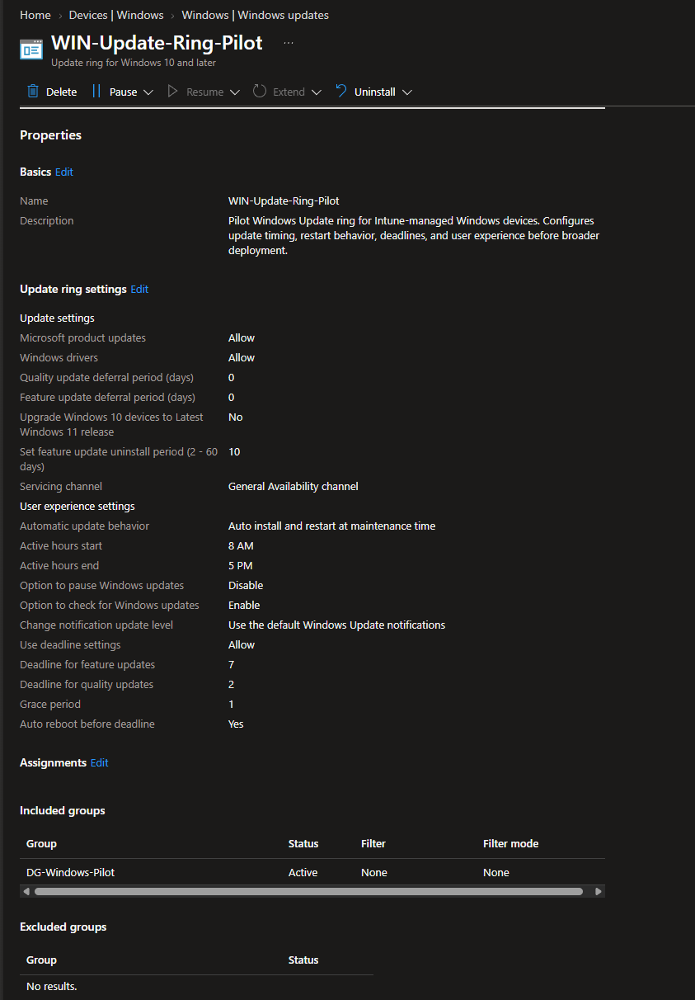

---

## Endpoint Verification

I verified the policy directly on `WIN11-INTUNE01` under:

```text
Windows Update
→ Advanced options
→ Configured update policies
```

Windows displayed the policies as:

```text
Type: Mobile Device Management
```

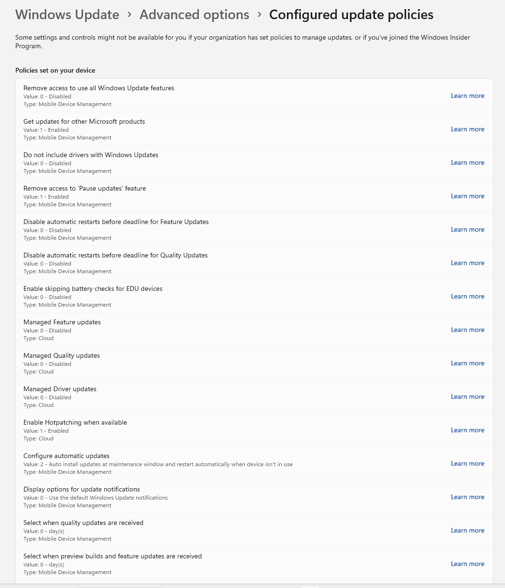

Additional update controls were also visible, including:

```text
Quality update deadline: 2 days
Feature update deadline: 7 days
Grace period: 1 day
Active hours: 8:00 AM - 5:00 PM
```

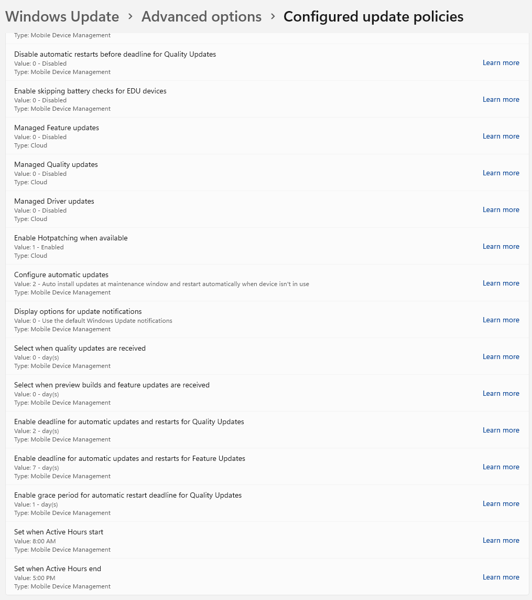

This confirmed that the Intune Update Ring was successfully applied to the endpoint.

---

# 13. BitLocker Management

Before creating the Intune BitLocker policy, I verified the VM's security prerequisites.

I checked:

```powershell
Get-Tpm | Select-Object TpmPresent,TpmReady,TpmEnabled,TpmActivated
```

I also verified:

```powershell
Confirm-SecureBootUEFI
```

```powershell
Get-ComputerInfo | Select-Object BiosFirmwareType
```

```cmd
reagentc /info
```

and:

```powershell
Get-BitLockerVolume -MountPoint "C:"
```

The VM reported:

```text
TPM present: True
TPM ready: True
TPM enabled: True
TPM activated: True

Secure Boot: True
Firmware: UEFI
Windows RE: Enabled

VolumeStatus: FullyEncrypted
ProtectionStatus: On
EncryptionPercentage: 100
EncryptionMethod: XtsAes128
```

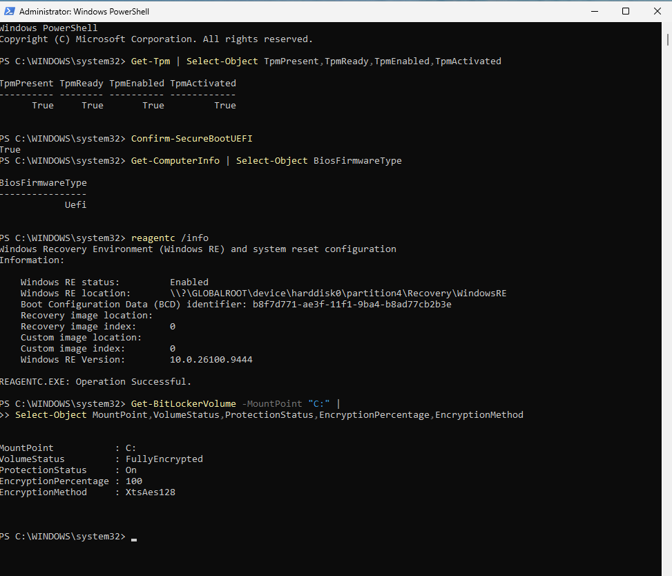

---

## Intune BitLocker Policy

I created:

```text
WIN-BitLocker-Pilot
```

and assigned it to:

```text
DG-Windows-Pilot
```

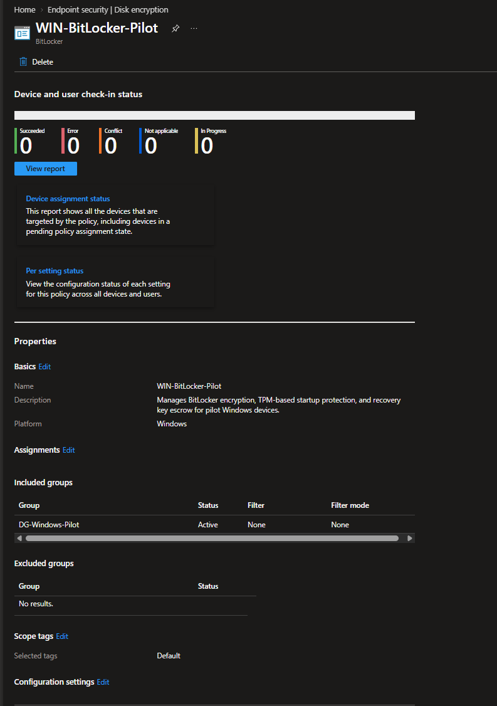

The policy configured TPM-based startup behavior.

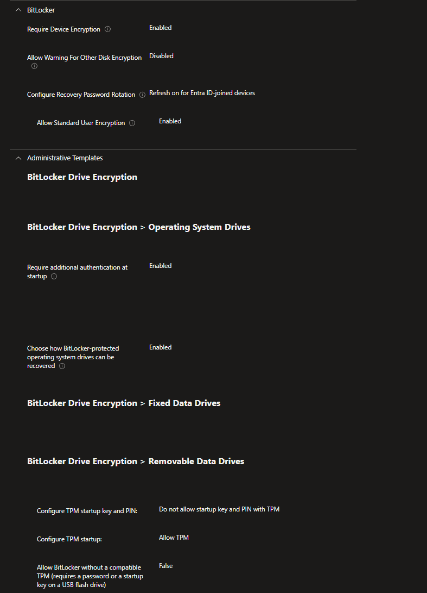

I also configured recovery behavior, including a 48-digit recovery password and centralized recovery information.

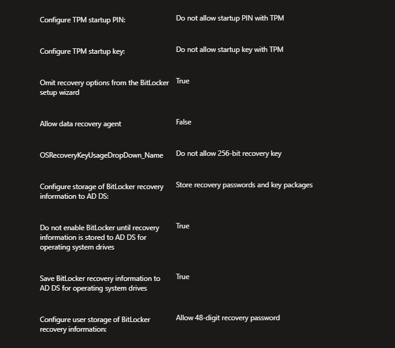

---

## Recovery Key Escrow Verification

I verified that the operating system drive had a BitLocker recovery-key record available through Intune without exposing the actual recovery password.

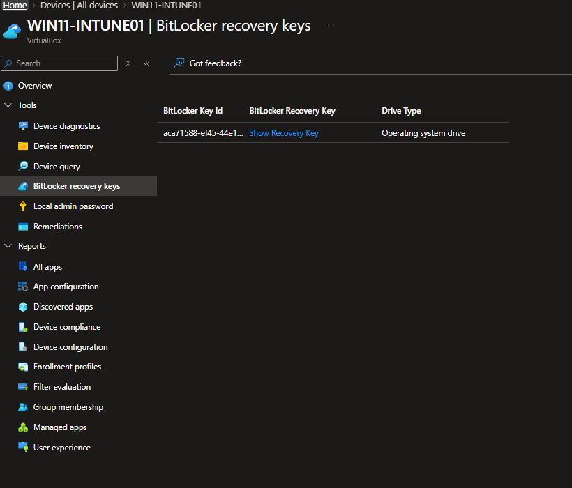

Intune later reported the policy deployment as:

```text
Succeeded: 1
Errors: 0
Conflicts: 0
```

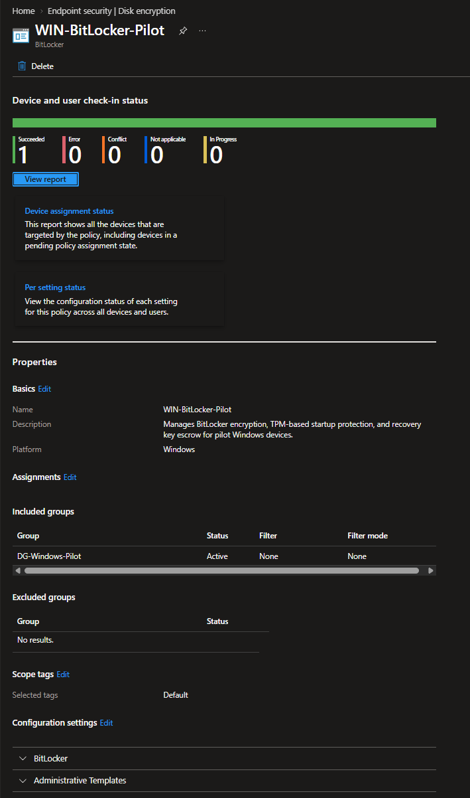

---

# 14. Help Desk Identity Lifecycle and Troubleshooting

To simulate a realistic identity-support incident, I created a new employee:

```text
Elena Marquez
Procurement Coordinator
Operations
```

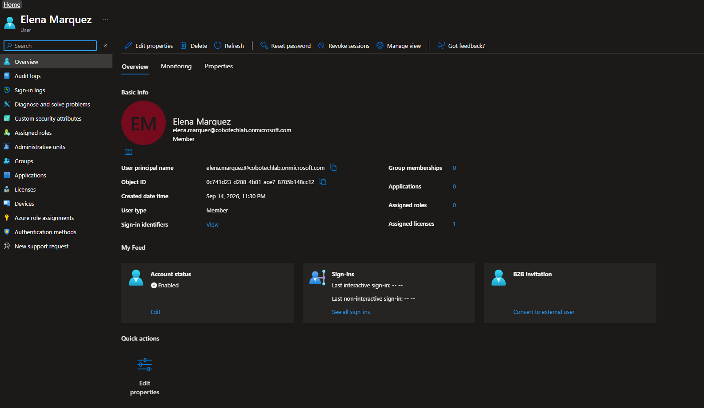

I assigned Microsoft 365 Business Premium to the account.

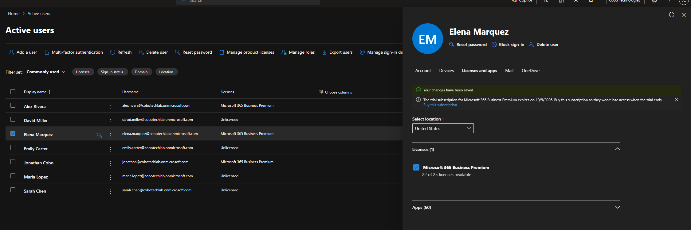

Elena completed initial password change and MFA enrollment.

A healthy OfficeHome sign-in was recorded as:

```text
Status: Success
```

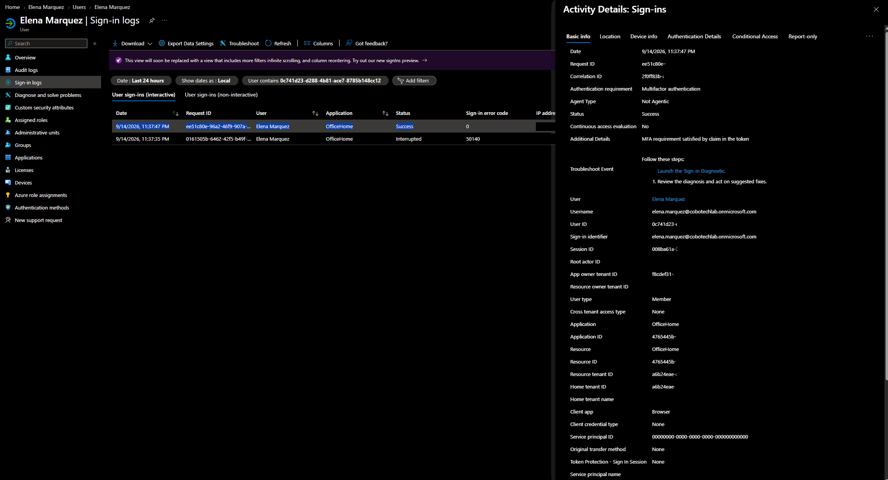

---

## Simulated Account Access Incident

I administratively blocked Elena from signing in.

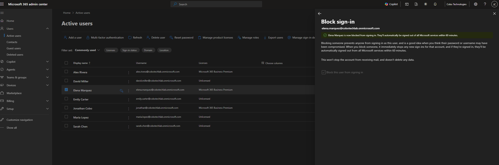

When Elena attempted to sign in again, the user-facing message stated:

```text
Your account has been locked.
Contact your support person to unlock it, then try again.
```

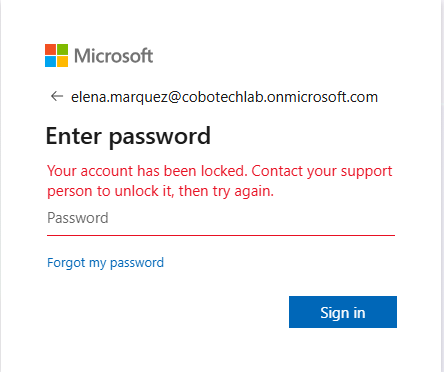

Rather than assuming the password was incorrect, I investigated the Entra sign-in logs.

The actual failure showed:

```text
Status: Failure

Sign-in error code:
50057

Failure reason:
The user account is disabled.
```

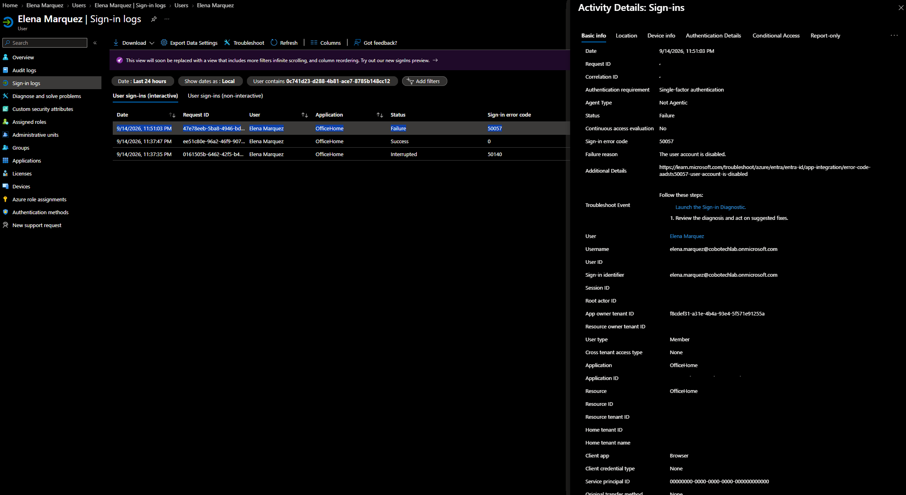

This demonstrated why Entra sign-in logs are more useful than relying only on the end-user error message.

---

## Account Recovery

I restored Elena's ability to sign in.

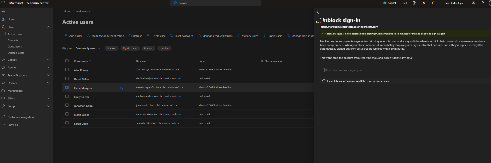

A new OfficeHome sign-in then showed:

```text
Status: Success
```


The complete troubleshooting sequence was:

```text
Healthy account
      |
      v
Administrator blocks sign-in
      |
      v
User reports account locked
      |
      v
Review Entra sign-in logs
      |
      v
Error 50057
User account disabled
      |
      v
Restore sign-in
      |
      v
Verify successful authentication
```

---

# 15. Windows LAPS

I enabled Microsoft Entra Windows LAPS at the tenant level.


I then created:

```text
WIN-LAPS-Pilot
```

The policy configured:

```text
Backup directory:
Microsoft Entra ID only

Password age:
30 days

Password length:
20 characters

Password complexity:
Uppercase + lowercase + numbers + special characters

Post-authentication reset delay:
8 hours

Automatic account management:
Enabled

Managed account:
Cobo-LAPSAdmin
```


---

## Endpoint Verification

After syncing the endpoint, Windows automatically created:

```text
Cobo-LAPSAdmin
```

I verified the account with:

```powershell
Get-LocalUser | Select-Object Name,Enabled,Description
```

The account appeared as:

```text
Cobo-LAPSAdmin
Enabled: True
```

Windows also identified it as automatically managed by the organization.


---

## LAPS Password Backup

Intune displayed the LAPS password record without exposing the password itself.

The page showed:

```text
Account:
Cobo-LAPSAdmin

Last password rotation:
Recorded

Next password rotation:
Recorded
```


This demonstrated centralized local-administrator password management and automatic password rotation.

---

# 16. Remote Endpoint Administration

For the final technical exercise, I issued a remote restart against:

```text
WIN11-INTUNE01
```

through Microsoft Intune.

Intune confirmed:

```text
Restart initiated.
Restart will occur when the device is notified.
```


The endpoint then received the command and displayed:

```text
You're about to be signed out

Your device administrator has scheduled a reboot
```


This demonstrated direct administrative control of an Intune-managed Windows endpoint.

---

# Troubleshooting Highlights

| Scenario | Diagnosis | Resolution |
|---|---|---|
| Firewall compliance failure | Intune identified Firewall as Not compliant | Restored active Defender Firewall profile |
| Conditional Access device failure | Entra identified managed device as noncompliant | Restored endpoint compliance |
| Missing device identity | Sign-in showed no Device ID and Managed: No | Retested through managed Edge profile |
| Blocked Microsoft 365 user | Entra error 50057 identified disabled account | Restored account sign-in |
| Win32 deployment reporting delay | Application installed before portal status updated | Verified endpoint and waited for Intune reporting |
| LAPS account creation delay | Managed account had not yet processed | Synced device and triggered policy processing |

---

# Key Lessons

This project reinforced several important Microsoft administration concepts:

- Microsoft Entra join and Intune enrollment are related but separate states.
- Creating an Entra user does not automatically provide Microsoft 365 services.
- Group membership and licensing serve different purposes.
- Configuration policies modify endpoint settings.
- Compliance policies evaluate endpoint state.
- Required application assignments force installation.
- Win32 requirement rules determine whether an application applies to a device.
- Win32 detection rules determine whether an application is installed.
- Conditional Access should be tested before enforcement.
- Report-only mode provides a safe way to validate access policies.
- Device-based Conditional Access depends on valid device identity being included in the sign-in.
- Intune reporting can lag behind the actual endpoint state.
- BitLocker recovery passwords should be centrally managed without being exposed publicly.
- Windows LAPS reduces the risk of shared or static local administrator passwords.
- Sign-in logs provide more accurate troubleshooting information than generic user-facing errors.
- Pilot groups provide a safer method for testing policies before broader deployment.

---

# Skills Demonstrated

- Microsoft 365 Administration
- Microsoft Entra ID
- Microsoft Intune
- Windows 11 Administration
- Identity and Access Management
- User Administration
- Group Administration
- Microsoft 365 Licensing
- Device Enrollment
- Endpoint Configuration
- Device Compliance
- Conditional Access
- Multi-Factor Authentication
- Microsoft Store Application Deployment
- Win32 Application Packaging
- MSI Deployment
- Windows Update Management
- BitLocker
- Windows LAPS
- Endpoint Security
- Sign-In Log Analysis
- Help Desk Troubleshooting
- Remote Endpoint Administration
- PowerShell

---

# Repository Structure

```text
microsoft-365-entra-intune-lab/
│
├── README.md
├── SCREENSHOTS.md
├── .gitignore
│
└── screenshots/
    ├── 01-microsoft-365-tenant-created.png
    ├── 02-entra-id-first-user-created.png
    ├── 03-entra-id-it-security-group.png
    ├── ...
    ├── 56-laps-password-backup-verified.png
    ├── 57-intune-remote-restart-initiated.png
    └── 58-intune-remote-restart-received.png
```

---

# Security and Repository Hygiene

This repository intentionally does **not** contain:

- User passwords
- Temporary passwords
- MFA QR codes
- Authenticator secrets
- MFA verification codes
- BitLocker recovery passwords
- LAPS-managed local administrator passwords
- Bulk provisioning CSV files containing passwords
- Microsoft 365 billing information
- Third-party installers
- `.intunewin` application packages

Screenshots are used to provide configuration and troubleshooting evidence while keeping credentials and recovery secrets protected.

---

# Screenshot Evidence Index

The README documents the complete workflow inline.

A separate screenshot index is also available for quickly locating individual pieces of evidence:

[View the complete screenshot evidence index](SCREENSHOTS.md)

---

## Project Status

**Completed**

The final lab demonstrates an end-to-end Microsoft cloud administration environment covering identity, licensing, endpoint enrollment, policy deployment, application management, compliance, Conditional Access, Windows security, account troubleshooting, credential management, and remote device administration.
